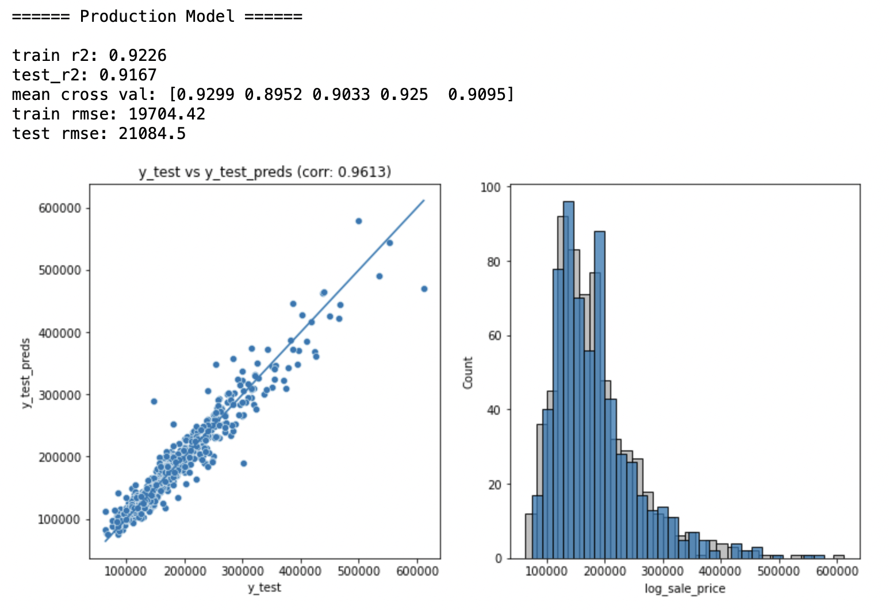

# DSI Project 2: Linear Regression Model on Ames Housing Dataset to Predict Sale Prices

## Table of Content
[1. Project Overview](#project-overview)<br>
[2. Abstract](#abstract)<br>
[3. Project Workflow](#project-workflow)<br>
[4. Repository Structure](#repository-structure)<br>
[5. File Description](#file-description)<br>
[6. Production Model and Evaluation](#production-model-and-evaluation)


---

## Project Overview

The goal of this project is to create a **linear regression model** based on the Ames Housing Dataset to predict the price of a house at sale.


## Abstract

The initial dataset contains 82 columns. Cleaning and grouping of columns significantly simplifies the datasets and model to 60 columns, 25 numerical columns, 34 categorical columns, and 1 target variable column. This allows model iteration to be systematic and clean, as well as allow model interpretation to be more understandable. 

Kaggle submission model consists of 25 numerical columns and 14 categorical columns which performs well with 20,788 RMSE on kaggle, and the R^2 score of 0.93 and 0.91 for training and testing datasets. 

However, if I was to select one model for production it would be our iteration model that consists of 25 numerical columns and 6 categorical columns (generic quality related columns) - performing very well with 21,084 RMSE on test dataset and an R^2 score of 0.92 and 0.92. Selecting a more generic feature that every houses must have allows the model to be more robust in the future as well as more resistance to overfitting.


## Project Workflow


1. Explore the datasets to understand what each columns mean as many terms are american housing related terms. This process involves researching and understanding what feature of american house contributes to the price and other technical terms e.g. sale type and sale condition.

2. Once I have a clear understanding of the dataset, I begin to explore the dataset with EDA in order to understand the dataset further and ultimately deal with missing values. Missing values from this dataset was dealt with in 4 ways (dropping, impute mode, impute 0, and impute 'None')

3. Once there are no missing values, the relationship between columns was then investigated in order to combine and drop redundant columns. Leaving columns that are highly related (i.e. dependent columns) will confuse the model which usually results in suboptimal coefficients and model performance.

4. Cleaning of categorical columns involves exploring the mean of each groupby of column results, and combining the values of columns with uneven categorical value. This method allows us to simplify our categorical column and model to create flexibility and ability to take in new information.

5. Feature engineering was then carried out as our feature correlates better with natural log of sale price. Comparison of models during model iteration will support this decision.

6. With the data ready, I proceeded with creating a benchmarking model with top 5 numerical features ranks by correlation with target variable y (sale price). This benchmarking model serves as a baseline to assess our iterations performance.

7. Iterating through the model options systematically, from numerical to category, gives us the finalize production model consisting of 25 numerical features and 6 categorical feautres. This model is selected because it's simple and clean, allowing the model to become more robust and is less likely to overfit in the future.

<br>

## Repository Structure 
```
dsi_project_ames
|
|__ code
|   |__ 01_data_cleaning.ipynb   
|   |__ 02_data_preprocessing.ipynb   
|   |__ 02_data_preprocessing_discrete_to_category.ipynb
|   |__ 03_model_benchmarking.ipynb  
|   |__ 04_model_comparison.ipynb
|   |__ 05_kaggle_competition.ipynb
|   |__ 06_production_model_evaluation.ipynb
|  
|__ datasets
|   |__ train.csv
|   |__ test.csv
|   |__ train_fill.csv
|   |__ test_fill.csv
|   |__ train_cleaned.csv
|   |__ test_cleaned.csv
|   |__ test_cleaned_discrete.csv
|   |__ submission.csv
|
|__ figure
|   |__ 2nd_floor.png
|   |__ basement_sf.png
|   |__ bath.png
|   |__ ...
|
|__ model
|   |__ all_num_6_quality_cat.sav
|   |__ all_num_6qual_neighbour.sav
|   |__ all_num_10_cat.sav
|   |__ all_num_many_cat.sav
|
|__ README.md
|
|__ data_dictionary.md
```
<br>

## File Description
<br>

    01_data_cleaning.ipynb
- EDA to understand the dataset
- Cleaning of missing values using different methods

<br>

    02_data_preprocessing.ipynb
- Grouping of columns
- Removing redundant columns
- Cleaning up categorical values

<br>

    02_data_preprocessing_discrete_to_categorry.ipynb

- Converting discrete columns to categorical instead of numerical
- Everything else is the same as above

<br>

    03_model_benchmarking.ipynb
- Creating a benchmarking model

<br>

    04_model_comparison.ipynb
- Iterating over many combinations of models to find the optimal model

<br>

    05_kaggle_competition.ipynb
- File to generate kaggle competition format of prediction csv to submit on kaggle

<br>

    06_production_model_evaluation.ipynb
- This display performance of selection model for production as well as gives an overview of why this model was selected.

<br>

## Production Model and Evaluation

The model selected for production consists of:

```
# Numerical Columns 25

num_cols = ['overall_quality', 'total_sf','garage_cars','total_bath','year_built', 'has_fireplace', 'total_rooms_above_ground','has_open_porch', 'masonry_area', 'log_lot_area', 'lot_frontage',
'has_wood_deck', 'central_air', 'has_basement_sf','bedroom_above_ground', 'functional', 'street','has_2nd_floor_sf','month_sold', 'year_sold', 'lot_contour', 'lot_slope',
'overall_condition', 'kitchen_above_ground', 'lot_shape']

# Categorical Columns 6

cat_cols = ['external_quality','basement_quality','heating_quality','kitchen_quality','fireplace_quality','garage_quality']

```   
<br>



Evaluation:
- This model was selected for it's simplicity
- By cleaning up the numerical columns keeping all the remaining numerical column allows the model to perform well without overfitting
- Additionally, by selecting a more generic categorical columns such as quality related column, we can further reduce the RMSE of the model to 19,704 for training data and 21,084 for testing data
- Looking at the R^2 of both the training and testing datasets shows very little differences (0.006), overfitting should not be the case
- Cross validation scores shows the same conclusion